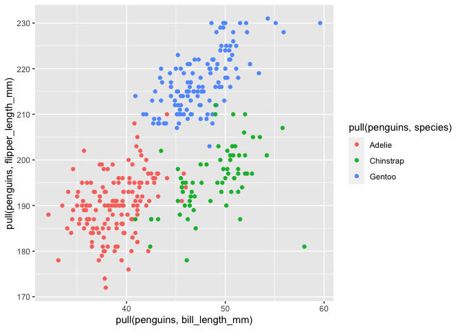

HW1
================
Chen Mo
9/18/2020

This is my solution to HW1

``` r
library(tidyverse)
```

    ## ── Attaching packages ────────────────────────────────────────────────────────── tidyverse 1.3.0 ──

    ## ✓ ggplot2 3.3.2     ✓ purrr   0.3.4
    ## ✓ tibble  3.0.3     ✓ dplyr   1.0.2
    ## ✓ tidyr   1.1.2     ✓ stringr 1.4.0
    ## ✓ readr   1.3.1     ✓ forcats 0.5.0

    ## ── Conflicts ───────────────────────────────────────────────────────────── tidyverse_conflicts() ──
    ## x dplyr::filter() masks stats::filter()
    ## x dplyr::lag()    masks stats::lag()

\#\#Problem 1

Create a data frame:

``` r
prob1_df = tibble(
        sample = rnorm(10),
        sample_greater_0 = sample > 0,
        char_vector = c("a", "b", "c", "d", "e", "f", "g", "h", "i", "j"),
        fac_vector = factor(c("small", "small", "small", "medium", "medium", "medium", "large", "large", "large", "large"))
)
```

Take the mean of each variable in my data frame:

``` r
mean(pull(prob1_df, sample))
```

    ## [1] -0.1529267

``` r
mean(pull(prob1_df, sample_greater_0))
```

    ## [1] 0.4

``` r
mean(pull(prob1_df, char_vector))
```

    ## Warning in mean.default(pull(prob1_df, char_vector)): argument is not numeric or
    ## logical: returning NA

    ## [1] NA

``` r
mean(pull(prob1_df, fac_vector))
```

    ## Warning in mean.default(pull(prob1_df, fac_vector)): argument is not numeric or
    ## logical: returning NA

    ## [1] NA

The mean function works for numbers and logical but not character or
factor.

Use as.numeric function to convert variables from one type to another

``` r
as.numeric(pull(prob1_df, sample_greater_0))
```

    ##  [1] 1 1 1 0 0 1 0 0 0 0

``` r
as.numeric(pull(prob1_df, char_vector))
```

    ## Warning: NAs introduced by coercion

    ##  [1] NA NA NA NA NA NA NA NA NA NA

``` r
as.numeric(pull(prob1_df, fac_vector))
```

    ##  [1] 3 3 3 2 2 2 1 1 1 1

The as.numeric function works for logical and factor but not character.
This means character variables do not have default value in R. For
factor variables, they have default value in R, so I can get a numeric
value when i use as.numeric function for factor variables. But in the
real world, factor variables do not have default value applied to them.
So i can not get the mean value of factor variables. For character
variables, no default value are applied to them in R or in the real
world.So I can not use mean function or even as.numeric function to
character variables.

Calculations:

``` r
as.numeric(pull(prob1_df, sample_greater_0))*pull(prob1_df, sample)
```

    ##  [1] 0.6078534 1.4228403 1.9075634 0.0000000 0.0000000 0.6411047 0.0000000
    ##  [8] 0.0000000 0.0000000 0.0000000

``` r
as.factor(pull(prob1_df, sample_greater_0))*pull(prob1_df, sample)
```

    ## Warning in Ops.factor(as.factor(pull(prob1_df, sample_greater_0)),
    ## pull(prob1_df, : '*' not meaningful for factors

    ##  [1] NA NA NA NA NA NA NA NA NA NA

``` r
as.numeric(as.factor(pull(prob1_df, sample_greater_0)))*pull(prob1_df, sample)
```

    ##  [1]  1.2157067  2.8456806  3.8151269 -1.0175191 -1.1244890  1.2822093
    ##  [7] -0.4987023 -2.5267543 -0.4237904 -0.5173738

\#\#Problem2

Load the penguins dataset:

``` r
data("penguins", package = "palmerpenguins")
```

Write a short description of the penguins data set:

The data in this data set including species, island, bill\_length\_mm,
bill\_depth\_mm, flipper\_length\_mm, body\_mass\_g, sex, year.  
The value of bill\_length\_mm ranges from 59.6 to 32.1.  
The value of bill\_depth\_mm ranges from 21.5 to 13.1.  
The value of flipper\_length\_mm ranges from 231 to 172.  
The value of body\_mass\_g ranges from 6300 to 2700.  
The value of year ranges from 2009 to 2007.  
The categories of species are Adelie, Chinstrap, Gentoo.  
The categories of island are Biscoe, Dream, Torgersen.  
The categories of sex are female, male.  
The size of the data set is 344 rows and 8 columns.  
The mean flipper length is 200.9152047.

Make a scatterplot of flipper\_length\_mm VS bill\_length\_mm:

``` r
ggplot(penguins, aes(x = pull(penguins, bill_length_mm), y = pull(penguins, flipper_length_mm), color = pull(penguins, species))) + geom_point(na.rm = TRUE)
```

<!-- -->

Export my first scatterplot to my project directory:

``` r
ggsave('scatterplot_penguins.pdf', height = 4, width = 6)
```
